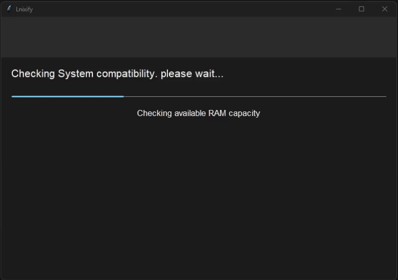

# WinGone

## Description

WinGone is a powerful tool that allows you to install native Fedora Linux quickly and seamlessly from your Windows machine. WinGone streamlines the installation process and does not require a spare USB stick.

## Why WinGone?

### Use this App if:

- You want to save time, such as after you've purchased a new Windows machine and want a super quick transition to Linux, WinGone is the perfect solution for you.

### Do not use this App if:

- **Trying Fedora Linux**: The best way to try Fedora Linux is by booting the Live Environment from an external USB storage.

- **Unfamiliar with the Process / No Spare USB Stick**: Things can go wrong, potentially bricking your system temporarily. Therefore, it's recommended that you have some knowledge of manual OS installation and possess a spare USB stick.
